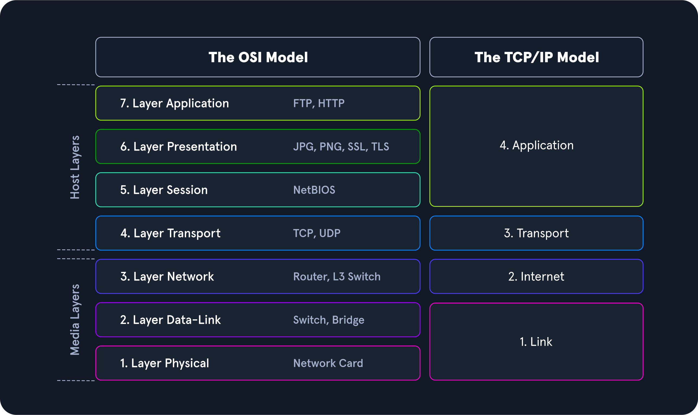
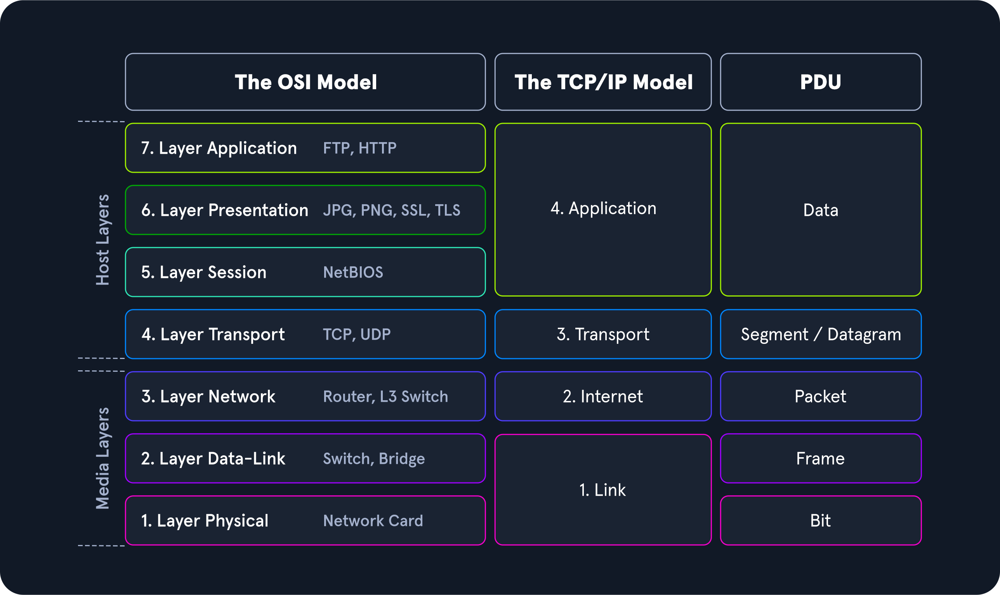
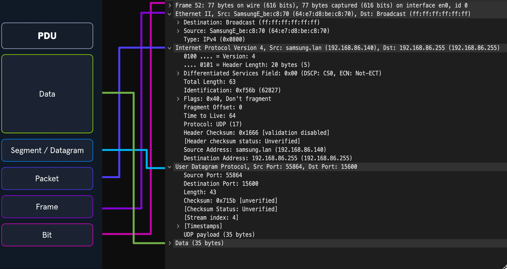
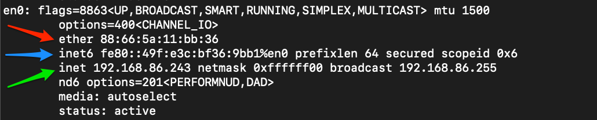
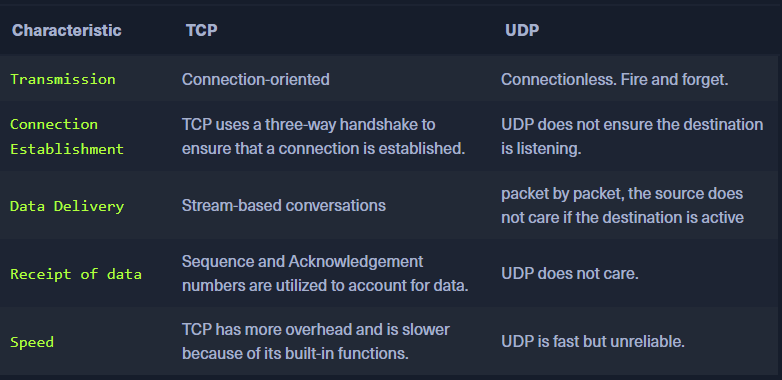
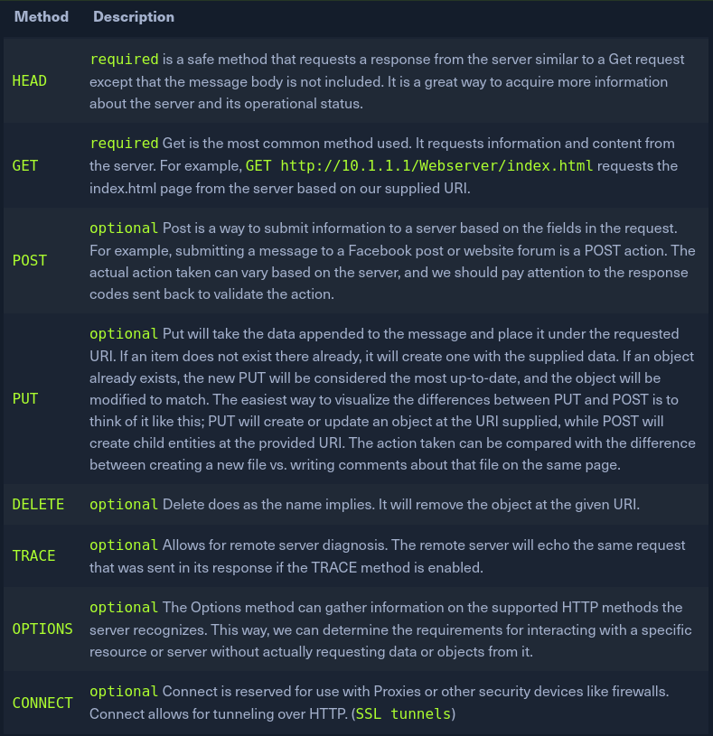
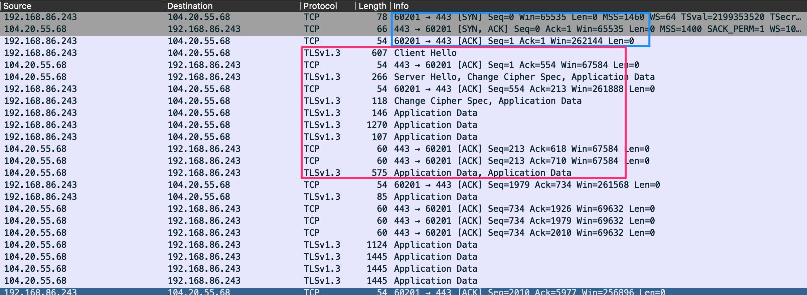
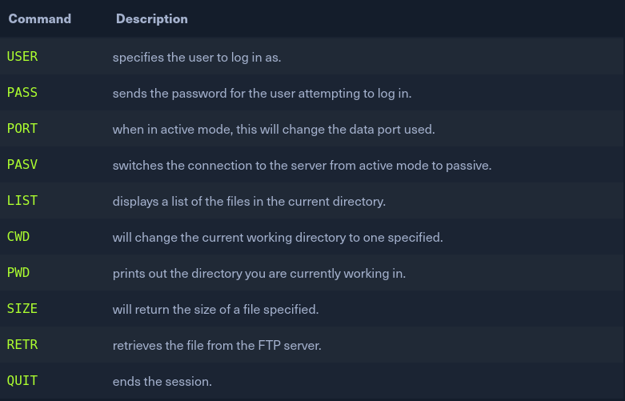

# Network Traffic Analysis
## Introduction
- **NTA** is the act of examining network traffic to characterize common ports and protocols utilized, establish a baseline for our environment, monitor and respond to threats, and ensure the greatest possible insight into our organization's network.
- This process helps security specialists determine anomalies, including security threats in the network, early and effectively pinpoint threats.
- It can also facilitate the processof meeting security guidelines.
### NTA Use Cases
1. Collecting real-time traffic within the network to analyze upcoming threats.
2. Setting a baseline for day-to-day network communications.
3. Identifying and analyzing traffic from non-standard ports, suspicious hosts, and issues with networking protocols such as HTTP errors, problems with TCP, or other networking misconfigurations.
4. Detecting malware on the wire, such as ransomware, exploits, and non-standard interactions.

### Common Traffic Analysis Tools
1. **tcpdump**: tcpdump is a command-line utility that, with the aid of LibPcap, captures and interprets network traffic from a network interface or capture file.
2. **Tshark**: TShark is a network packet analyzer much like TCPDump. It will capture packets from a live network or read and decode from a file. It is the command-line variant of Wireshark.
3. **Wireshark**: Wireshark is a graphical network traffic analyzer. It captures and decodes frames off the wire and allows for an in-depth look into the environment.
4. **NGrep**: NGrep is a pattern-matching tool built to serve a similar function as grep for Linux distributions. The big difference is that it works with network traffic packets. NGrep understands how to read live traffic or traffic from a PCAP file and utilize regex expressions and BPF syntax.
5. **tcpick**: tcpick is a command-line packet sniffer that specializes in tracking and reassembling TCP streams. 
6. **Network Taps**:Taps (Gigamon, Niagra-taps) are devices capable of taking copies of network traffic and sending them to another place for analysis. These can be in-line or out of band. They can actively capture and analyze the traffic directly or passively by putting the original packet back on the wire as if nothing had changed.
7. **Networking Span Ports**: Span Ports are a way to copy frames from layer two or three networking devices during egress or ingress processing and send them to a collection point. Often a port is mirrored to send those copies to a log server.
8. **Elastic Stack**: The Elastic Stack is a culmination of tools that can take data from many sources, ingest the data, and visualize it, to enable searching and analysis of it.
9. **SIEMS**: SIEMS (such as Splunk) are a central point in which data is analyzed and visualized. Alerting, forensic analysis, and day-to-day checks against the traffic are all use cases for a SIEM.
### NTA Workflow

**1. Ingest Traffic**

Once we have decided on our placement, begin capturing traffic. Utilize capture filters if we already have an idea of what we are looking for.

**2. Reduce Noise by Filtering**

Capturing traffic of a link, especially one in a production environment, can be extremely noisy. Once we complete the initial capture, an attempt to filter out unnecessary traffic from our view can make analysis easier.

**3. Analyze and Explore**

Now is the time to start carving out data pertinent to the issue we are chasing down. Look at specific hosts, protocols, even things as specific as flags set in the TCP header. The following questions will help us:
1. Is the traffic encrypted or plain text? Should it be?
2. Can we see users attempting to access resources to which they should not have access?
3. Are different hosts talking to each other that typically do not?

**4. Detect and Alert**

1. Are we seeing any errors? Is a device not responding that should be?
2. Use our analysis to decide if what we see is benign or potentially malicious.
3. Other tools like IDS and IPS can come in handy at this point. They can run heuristics and signatures against the traffic to determine if anything within is potentially malicious.

**5. Fix and Monitor**

Fix and monitor is not a part of the loop but should be included in any workflow we perform. If we make a change or fix an issue, we should continue to monitor the source for a time to determine if the issue has been resolved.

## Networking Primer - Layers 1-4
### OSI / TCP-IP Models
**Networking Models**

-  The models are a graphical representation of how communication is handled between networked computers.

**Model Traits Comparison.**
1. OSI has 7 layers while TCP-IP has 4 layers
2. OSI flexibility is strict while for TCP-IP is loose
3. OSI is protocol indepedent and generic while TCP-IP is dependent on commoncommunication protocols.
4. OSI model is segmented- broken down into small functional chunks more than the TCP-IP model.
- Layers 1-4 of the OSI model are focused on controlling the transportation of data between hosts.
- Layers 5-7 handle the interpretation, management, and presentation of the encapsulated data presented to the end-user.
The TCP-IP model comprises 4 layers: 
* layers 5-7 of the OSI model align with layer 4 of the TCP-IP model, the **Application layer**. 
* Layer 3 deals with **transportation**.
* layer 2 is the **internet layer** which aligns with the network layer in OSI. 
* layer 1 is the **link-layer** which covers layers 1-2 of the OSI model.

### PDU Example
- A PDU is a data packet made up of control information and data encapsulated from each layer of the OSI model.

### PDU Packet Breakdown

### Addressing Mechanisms
#### MAC-Addressing
- Each logical or physical interface attached to a host has a Media Access Control (**MAC**) address. This address is a 48-bit **six octet** address represented in hexadecimal format. We can see an example of one by the red arrow.

- MAC-addressing is utilized in Layer two communications between hosts.
#### IP Addressing
- The Internet Protocol (**IP**) was developed to deliver data from one host to another across network boundaries.
- IP is responsible for routing packets, the encapsulation of data, and fragmentation and reassembly of datagrams when they reach the destination host.
- IP is a connectionless protocol that provides no assurances that data will reach its intended recipient. For the reliability and validation of data delivery, IP relies on upper-layer protocols such as TCP.
- There are two main versions of IP:
1. IPv4, which is the current dominant standard, 
2. IPv6, which is intended to be the successor of IPv4.
**IPv4**
- IPv4 addressing is the core method of routing packets across networks to hosts located outside our immediate vicinity. We can see an example of one by the green arrow on the above image
- An IPv4 address is made up of a 32-bit four octet number represented in decimal format. e.g. 192.168.86.243
- Each octet of an IP address can be represented by a number ranging from 0 to 255.
- When examining a PDU, we will find IP addresses in layer three (Network) of the OSI model and layer two (internet) of the TCP-IP model. 
**IPv6**
- After a little over a decade of utilizing IPv4, it was determined that we had quickly exhausted the pool of usable IP addresses.
- To help solve this issue, two things were done:
1. Implementing variable-length subnet masks (VLSM) and Classless Inter-Domain Routing (CIDR). This allowed us to redefine the useable IP addresses in the v4 format changing how addresses were assigned to users.
2. Creation and continued development of IPv6 as a successor to IPv4.
- IPv6 provides us a much larger address space that can be utilized for any networked purpose.
- IPv6 is a 128-bit address 16 octets represented in Hexadecimal format. We can see an example of shortened one by the blue arrow on the above image.
-  IPv6 provides: Better support for Multicasting (sending traffic from one to many) Global addressing per device Security within the protocol in the form of IPSec Simplified Packet headers allow for easier processing and move from connection to connection without being re-assigned an address.

**IPv6 Addressing Types**
1. **Unicast**: Addresses for a single interface. It is host-to-host
2. **Anycast**:	Addresses for multiple interfaces, where only one of them receives the packet. It is one to many in a group where only one will answer the packet.
3. **Multicast**: Addresses for multiple interfaces, where all of them receive the same packet. It is 0ne to many
4. **Broadcast**: Does not exist and is realized with multicast addresses.

### TCP / UDP, Transport Mechanisms
- The Transport Layer has several mechanisms to help ensure the seamless delivery of data from source to destination.
- The two mechanisms used to accomplish this task are the Transmission Control (TCP) and the User Datagram Protocol (UDP).

**TCP VS. UDP Characteristics**

- TCP is considered a more reliable protocol since it allows for error checking and data acknowledgment as a normal function. 
- UDP is a quick, fire, and forget protocol best utilized when we care about speed over quality and validation.
- TCP is utilized when moving data that requires completeness over speed.
#### TCP Three-way Handshake
- One of the ways TCP ensures the delivery of data from server to client is the utilization of sessions.
- These sessions are established through a **three-way handshake**.
- To make this happen, TCP utilizes an option in the TCP header called **flags (Synchronization (SYN) and acknowledgment (ACK))**.
- When a host requests to have a conversation with a server over TCP;

The **client** sends a packet with the SYN flag set to on along with other negotiable options in the TCP header.
This is a synchronization packet. It will only be set in the first packet from host and server and enables establishing a session by allowing both ends to agree on a sequence number to start communicating with.
This is crucial for the tracking of packets. Along with the sequence number sync, many other options are negotiated in this phase to include window size, maximum segment size, and selective acknowledgments.
The **server** will respond with a TCP packet that includes a SYN flag set for the sequence number negotiation and an ACK flag set to acknowledge the previous SYN packet sent by the host.
The server will also include any changes to the TCP options it requires set in the options fields of the TCP header.
The **client** will respond with a TCP packet with an ACK flag set agreeing to the negotiation.
This packet is the end of the three-way handshake and established the connection between client and server.
- Another flag we will see with TCP is the **FIN** flag. It is used for signaling that the data transfer is finished and the sender is requesting termination of the connection. The client acknowledges the receipt of the data and then sends a **FIN** and **ACK** to begin session termination. The server responds with an acknowledgment of the FIN and sends back its own FIN. Finally, the client acknowledges the session is complete and closes the connection. Before session termination, we should see a packet pattern of:
1. **FIN, ACK**
2. **FIN, ACK,**
3. **ACK**

## Networking Primer - Layers 5-7
### HTTP
- Hypertext Transfer Protocol (**HTTP**) is a stateless Application Layer protocol that has been in use since 1990. 
- HTTP enables the transfer of data in clear text between a client and server over TCP.
- The client would send an HTTP request to the server, asking for a resource. A session is established, and the server responds with the requested media (HTML, images, hyperlinks, video). 
- HTTP utilizes ports 80 or 8000 over TCP during normal operations. In exceptional circumstances, it can be modified to use alternate ports, or even at times, UDP.
### HTTP Methods
- To perform operations such as fetching webpages, requesting items for download, or posting your most recent tweet all require the use of specific methods. 
- These methods define the actions taken when requesting a URI.

### HTTPS
- HTTP Secure (**HTTPS**) is a modification of the HTTP protocol designed to utilize Transport Layer Security (TLS) or Secure Sockets Layer (SSL) with older applications for data security.
- TLS is utilized as an encryption mechanism to secure the communications between a client and a server.
- HTTPS utilizes ports 443 and 8443 instead of the standard port 80. This is a simple way for the client to signal the server that it wishes to establish a secure connection.
#### TLS Handshake Via HTTPS

 
1. Client and server exchange hello messages to agree on connection parameters.
2. Client and server exchange necessary cryptographic parameters to establish a premaster secret.
3. Client and server will exchange x.509 certificates and cryptographic information allowing for authentication within the session.
4. Generate a master secret from the premaster secret and exchanged random values.
5. Client and server issue negotiated security parameters to the record layer portion of the TLS protocol.
6. Client and server verify that their peer has calculated the same security parameters and that the handshake occurred without tampering by an attacker.

### FTP
- File Transfer Protocol (FTP) is an Application Layer protocol that enables quick data transfer between computing devices.
- FTP can be utilized from the command-line, web browser, or through a graphical FTP client such as FileZilla.
- FTP itself is established as an insecure protocol, and most users have moved to utilize tools such as **SFTP** to transfer files through secure channels.
- FTP uses ports 20 and 21 over TCP. Port 20 is used for data transfer, while port 21 is utilized for issuing commands controlling the FTP session. - FTP supports user authentication as well as allowing anonymous access if configured.
- FTP is capable of running in two different modes, **active** or **passive**. 
- Active is the default operational method utilized by FTP, meaning that the server listens for a control command PORT from the client, stating what port to use for data transfer. 
- Passive mode enables us to access FTP servers located behind firewalls or a NAT-enabled link that makes direct TCP connections impossible.
#### FTP Commands

### SMB
- Server Message Block (SMB) is a protocol most widely seen in Windows enterprise environments that enables sharing resources between hosts over common networking architectures.
- SMB is a connection-oriented protocol that requires user authentication from the host to the resource to ensure the user has correct permissions to use that resource or perform actions.
- In the past, SMB utilized NetBIOS as its transport mechanism over UDP ports 137 and 138. 
- Since modern changes, SMB now supports direct TCP transport over port 445, NetBIOS over TCP port 139, and the QUIC protocol.
- As a user, SMB provides us easy and convenient access to resources like printers, shared drives, authentication servers, and more. hence, SMB is very attractive to potential attackers as well.
