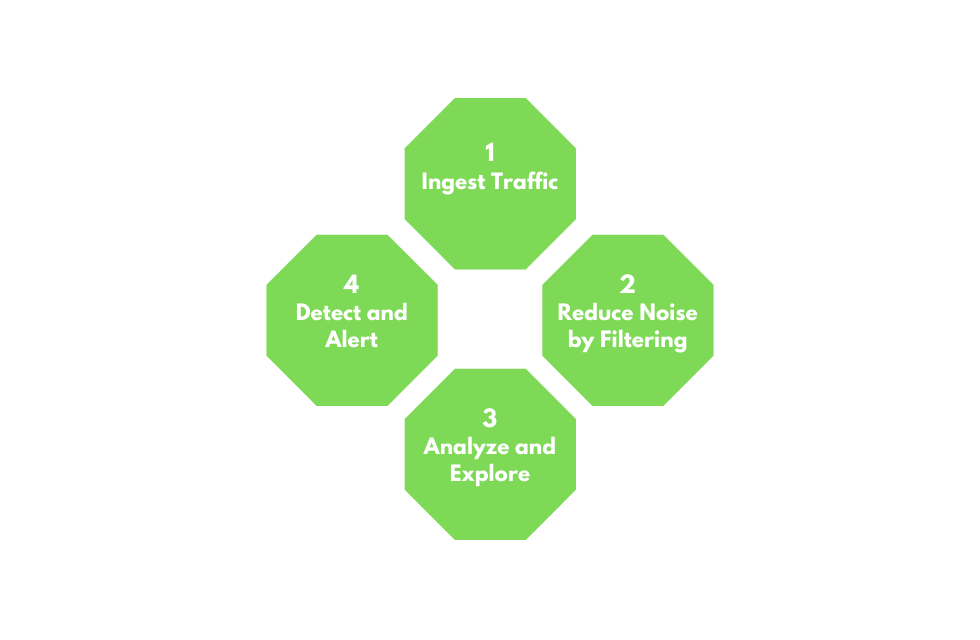

# Network Traffic Analysis
## Introduction
- **NTA** is the act of examining network traffic to characterize common ports and protocols utilized, establish a baseline for our environment, monitor and respond to threats, and ensure the greatest possible insight into our organization's network.
- This process helps security specialists determine anomalies, including security threats in the network, early and effectively pinpoint threats.
- It can also facilitate the processof meeting security guidelines.
### NTA Use Cases
1. Collecting real-time traffic within the network to analyze upcoming threats.
2. Setting a baseline for day-to-day network communications.
3. Identifying and analyzing traffic from non-standard ports, suspicious hosts, and issues with networking protocols such as HTTP errors, problems with TCP, or other networking misconfigurations.
4. Detecting malware on the wire, such as ransomware, exploits, and non-standard interactions.

### Common Traffic Analysis Tools
1. **tcpdump**: tcpdump is a command-line utility that, with the aid of LibPcap, captures and interprets network traffic from a network interface or capture file.
2. **Tshark**: TShark is a network packet analyzer much like TCPDump. It will capture packets from a live network or read and decode from a file. It is the command-line variant of Wireshark.
3. **Wireshark**: Wireshark is a graphical network traffic analyzer. It captures and decodes frames off the wire and allows for an in-depth look into the environment.
4. **NGrep**: NGrep is a pattern-matching tool built to serve a similar function as grep for Linux distributions. The big difference is that it works with network traffic packets. NGrep understands how to read live traffic or traffic from a PCAP file and utilize regex expressions and BPF syntax.
5. **tcpick**: tcpick is a command-line packet sniffer that specializes in tracking and reassembling TCP streams. 
6. **Network Taps**:Taps (Gigamon, Niagra-taps) are devices capable of taking copies of network traffic and sending them to another place for analysis. These can be in-line or out of band. They can actively capture and analyze the traffic directly or passively by putting the original packet back on the wire as if nothing had changed.
7. **Networking Span Ports**: Span Ports are a way to copy frames from layer two or three networking devices during egress or ingress processing and send them to a collection point. Often a port is mirrored to send those copies to a log server.
8. **Elastic Stack**: The Elastic Stack is a culmination of tools that can take data from many sources, ingest the data, and visualize it, to enable searching and analysis of it.
9. **SIEMS**: SIEMS (such as Splunk) are a central point in which data is analyzed and visualized. Alerting, forensic analysis, and day-to-day checks against the traffic are all use cases for a SIEM.
### NTA Workflow

**1. Ingest Traffic**
Once we have decided on our placement, begin capturing traffic. Utilize capture filters if we already have an idea of what we are looking for.

**2. Reduce Noise by Filtering**
Capturing traffic of a link, especially one in a production environment, can be extremely noisy. Once we complete the initial capture, an attempt to filter out unnecessary traffic from our view can make analysis easier.

**3. Analyze and Explore**
Now is the time to start carving out data pertinent to the issue we are chasing down. Look at specific hosts, protocols, even things as specific as flags set in the TCP header. The following questions will help us:
1. Is the traffic encrypted or plain text? Should it be?
2. Can we see users attempting to access resources to which they should not have access?
3. Are different hosts talking to each other that typically do not?

**4. Detect and Alert**
1. Are we seeing any errors? Is a device not responding that should be?
2. Use our analysis to decide if what we see is benign or potentially malicious.
3. Other tools like IDS and IPS can come in handy at this point. They can run heuristics and signatures against the traffic to determine if anything within is potentially malicious.

**5. Fix and Monitor**
Fix and monitor is not a part of the loop but should be included in any workflow we perform. If we make a change or fix an issue, we should continue to monitor the source for a time to determine if the issue has been resolved.